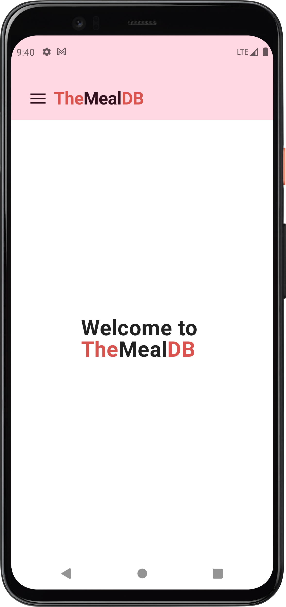
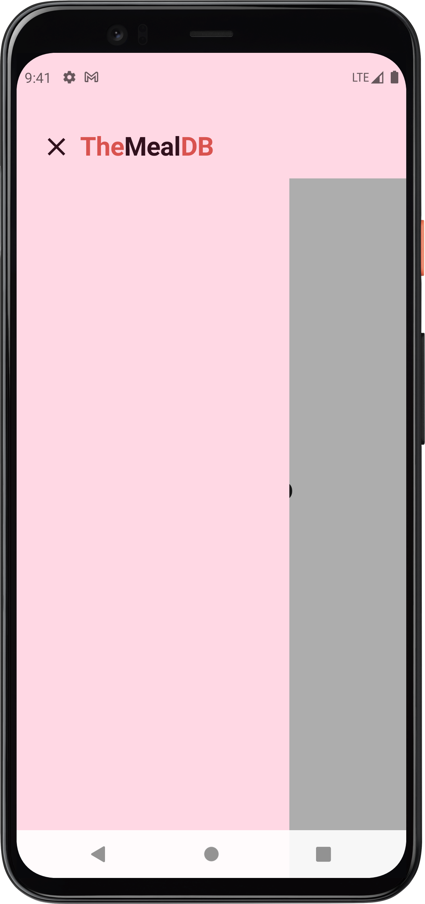
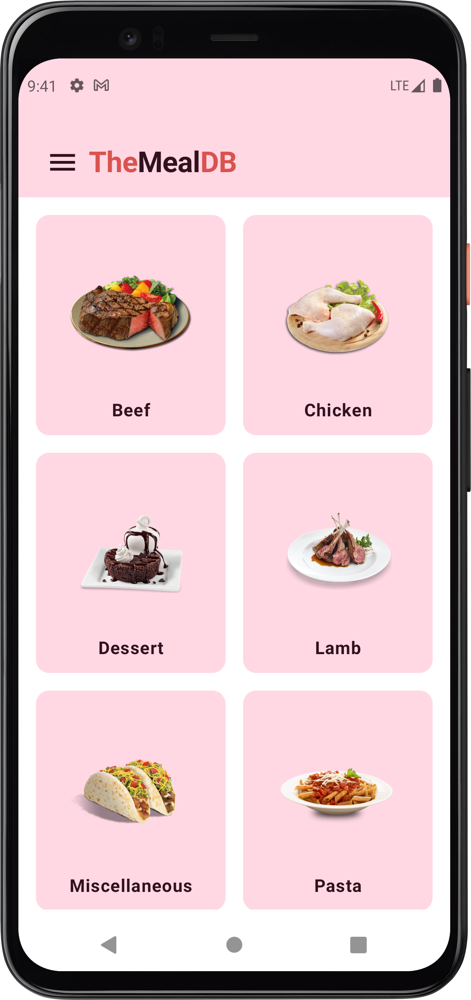

# TheMealDB

> A Meal App to Learn JSON, Databases, and other new concepts.


## Screenshots

<p align="center">
  
  
  
</p>

---

##  Features

- Load and parse meal data from JSON.
- Store and retrieve meals using a local database.
- Browse meals by category or cuisine.
- Search for specific meals by name or ingredient.
- Favorite meals and view them separately.
- View meal ingredients, instructions, and details.
<!-- - (Add more features as your app evolves…) -->

<!-- Screenshots placeholders -->

---

##  Installation & Setup

1. Clone the repository:
   ```bash
   git clone https://github.com/43H1-BOI/My_Meal_App.git
   cd My_Meal_App
